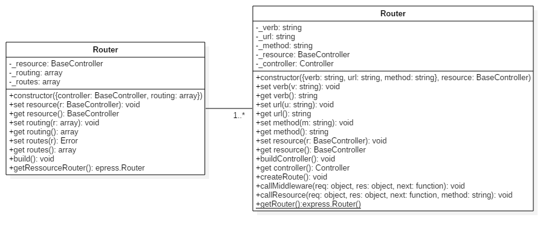

# Router and Route class

## Principles

### Router class

The Router class init an express router.

```javascript
const params = {
    // a controller constructor extending BaseController class
    controller,
    // an array of route object configuration
    routing: [{
        verb: 'get',
        url: '/test/:id([0-9]+)',
        method: 'controllerMethod'
    }]
};
```

```javascript
let router = new Router(params);
```

## Route class
```javascript
const params = {
    verb: 'get',
    url: '/test/:id([0-9]+)',
    method: 'controllerMethod'
};
```

```javascript
let route = new Route(params,resource);
```