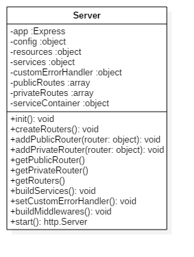

# Server

The server class return a node js http server.
## Class diagram

## Example
```javascript
// main.js
import Server from './Server';
import config from './config';
import * as setup from './kernel';

let params = {config, ...setup};

let server = new Server(params);
server.init();
server.start();
```
This code will output in console ```info: server started on localhost port: 3010```

## Parameters
The parameters are store in a javascript file named kernel.js. This file contains reference to your application.
```javascript
// kernel.js

// Obligatory parameters
export const publicResources = [{
  controller,
  routing
}];
export const privateResources = [...];
export const middlewares = {...};
export const services = {...};
export const customErrorHandler = {
  notFound: (req,res)=>{},
  internalServerError: (req,res)=>{}
};
```
Public and private resources are arrays of resources. Resources are like package.

## Config file
```javascript
// config.js

export const config = {
  development: {
    app: {
      // port the node instance listening
      port: 3010,
      // concerning the json web token
      // for auth users
      token: {
        secret: "secret",
        expire: 84000
      }
    },
    database: {
      host: "127.0.0.1",
      port: "5432",
      database: "test_db",
      user: "test",
      password: "test"
    }
  },
  production: {...}
```