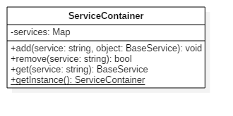

# Router and Route class

## Principles


### ServiceContainer class

The ServiceContainer class is a singleton.

```javascript
let serviceContainer = ServiceContainer.getInstance();
```

To add a service.
```javascript
serviceContainer.add('serviceName', new ServiceClass());
```
To get a service.
```javascript
let service = serviceContainer.get('serviceName');
// if the service doesn't exist, service = false
```
To remove a service.
```javascript
serviceContainer.remove('serviceName');
// return true if the service exist and was deleted,
// false if the service doesn't exist
```